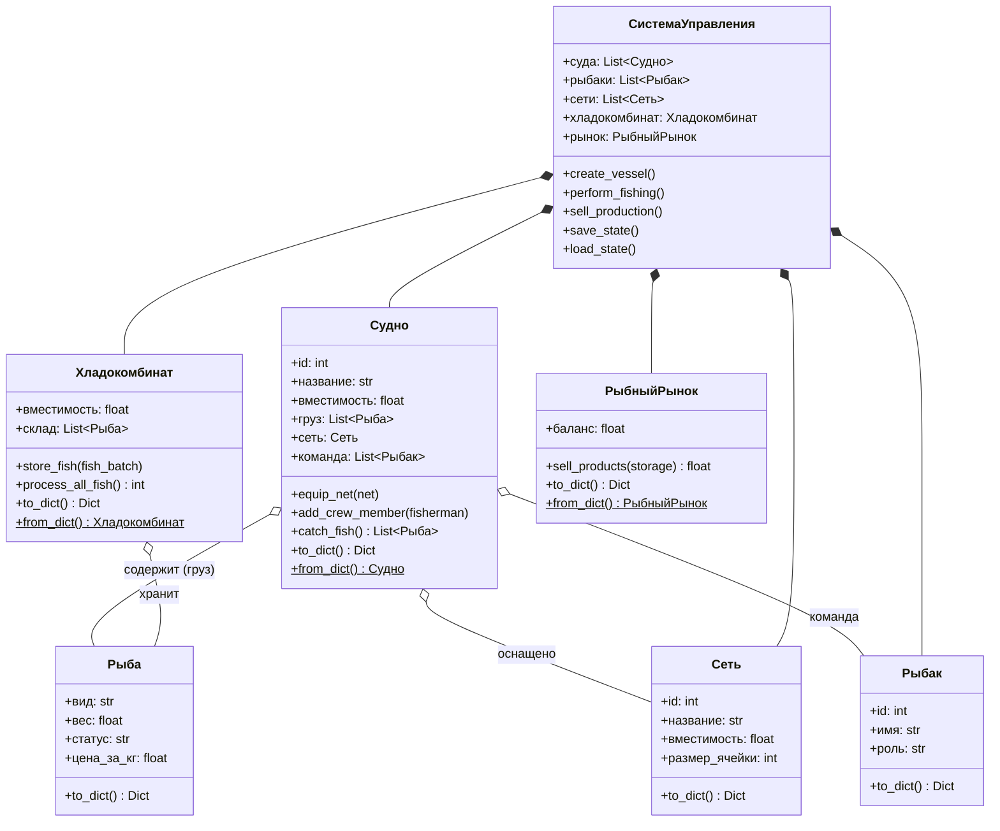

# Лабораторная работа №1 по курсу “Проектирование ПО интеллектуальных систем”

**Выполнил:** Змитревич Михаил Юрьевич, группа 4104

## Цель работы
1. Изучить основные возможности языка Python для разработки программных систем с интерфейсом командной строки (CLI).
2. Разработать программную систему на языке Python согласно описанию предметной области.

---

## Вариант 19: Модель рыболовного производства

**Предметная область:** Процесс вылова и переработки рыбы на рыбопромыслах.

**Ключевые сущности системы:** Рыболовное производство, рыбак, рыба, судно, сеть, хладокомбинат, рынок рыбной продукции.

---

## Архитектура системы (UML)

Система спроектирована с применением объектно-ориентированного анализа, паттернов проектирования и с учетом принципов SOLID.

### 1. Диаграмма классов
Отражает структуру сущностей, их атрибуты, методы и взаимосвязи (агрегацию, композицию).


### 2.Диаграмма состояний
Описывает жизненный цикл производственного процесса и переходы между состояниями системы.
```mermaid
stateDiagram-v2
    [*] --> ЗапускПрограммы
    ЗапускПрограммы --> АвтозагрузкаДанных : load_state()
    АвтозагрузкаДанных --> ГлавныйЦикл
    
    state ГлавныйЦикл {
        [*] --> ОжиданиеВвода
        ОжиданиеВвода --> ОбработкаКоманды : Ввод пользователя
        
        state ОбработкаКоманды {
            direction TB
            ПокупкаИНаём : add_vessel / add_fisher / add_net
            Назначение : assign / equip
            Производство : fish / unload / process
            Коммерция : sell
            Системные : status / save / load / help
        }
        
        ОбработкаКоманды --> ВыводРезультатаИлиОшибки
        ВыводРезультатаИлиОшибки --> ОжиданиеВвода
    }
    
    ГлавныйЦикл --> ВыходИзПрограммы : Команда "exit"
    ВыходИзПрограммы --> [*]
