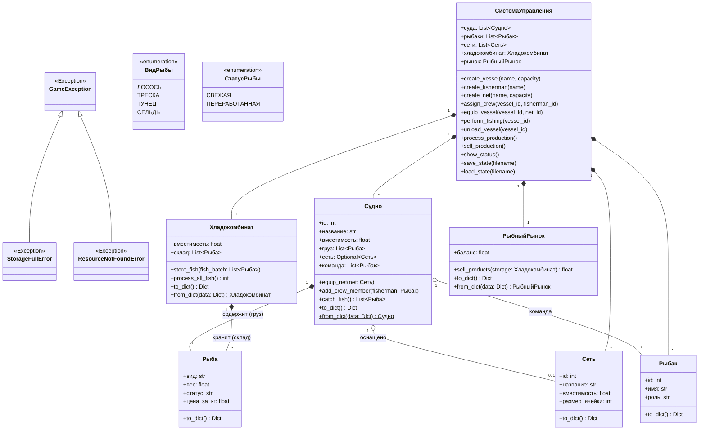

# Лабораторная работа №1 по курсу “Проектирование ПО интеллектуальных систем”

**Выполнил:** Змитревич Михаил Юрьевич, группа 4104

## Цель работы
1. Изучить основные возможности языка Python для разработки программных систем с интерфейсом командной строки (CLI).
2. Разработать программную систему на языке Python согласно описанию предметной области.

---

## Вариант 19: Модель рыболовного производства

**Предметная область:** Процесс вылова и переработки рыбы на рыбопромыслах.

**Ключевые сущности системы:** Рыболовное производство, рыбак, рыба, судно, сеть, хладокомбинат, рынок рыбной продукции.

---

## Архитектура системы (UML)

Система спроектирована с применением объектно-ориентированного анализа, паттернов проектирования и с учетом принципов SOLID.

### 1. Диаграмма классов
Отражает структуру сущностей, их атрибуты, методы и взаимосвязи (агрегацию, композицию).


### 2.Диаграмма состояний
Описывает жизненный цикл производственного процесса и переходы между состояниями системы.
```mermaid
flowchart TD
    Start([Запуск программы]) --> Init[Инициализация Системы Управления]
    Init --> Load[Автозагрузка данных: load_state]
    
    Load --> Loop{Главный цикл: while True}

    Loop --> Input[/Ожидание ввода команды/]
    Input --> CheckCmd{Проверка команды}

    CheckCmd -->|help| CmdHelp[Вывод справки]
    CheckCmd -->|status| CmdStatus[Вывод статуса]
    CheckCmd -->|add_vessel / add_fisher / add_net| CmdAdd[Создание сущности]
    CheckCmd -->|assign / equip| CmdEquip[Назначение персонала / Экипировка]
    CheckCmd -->|fish| CmdFish[Ловля рыбы: catch_fish]
    CheckCmd -->|unload| CmdUnload[Выгрузка на склад: store_fish]
    CheckCmd -->|process| CmdProcess[Переработка: process_all_fish]
    CheckCmd -->|sell| CmdSell[Продажа: sell_products]
    CheckCmd -->|save / load| CmdState[Сохранение / Загрузка состояния]
    
    CheckCmd -->|Неизвестная команда или ошибка| CmdError[Сообщение об ошибке]
    
    %% Явно выделенный блок выхода
    CheckCmd -->|exit| CmdExit[Завершение работы цикла]

    %% Возврат в цикл
    CmdHelp --> Loop
    CmdStatus --> Loop
    CmdAdd --> Loop
    CmdEquip --> Loop
    CmdFish --> Loop
    CmdUnload --> Loop
    CmdProcess --> Loop
    CmdSell --> Loop
    CmdState --> Loop
    CmdError --> Loop

    %% Финал
    CmdExit --> End([Выход из программы])
    
    style End fill:#f99,stroke:#333,stroke-width:2px
    style CmdExit fill:#ffcccb,stroke:#f00
