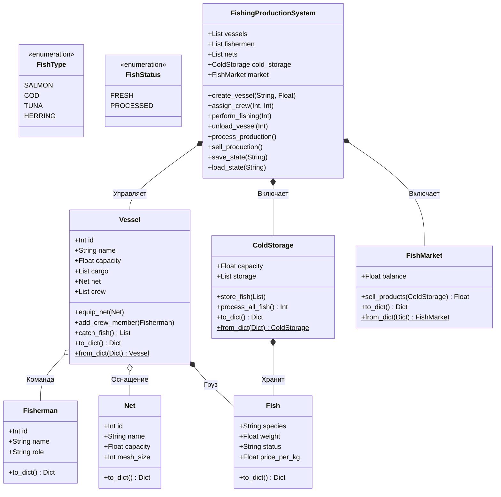

# Лабораторная работа №1 по курсу “Проектирование ПО интеллектуальных систем”

**Выполнил:** Змитревич Михаил Юрьевич, группа 4104

## Цель работы
1. Изучить основные возможности языка Python для разработки программных систем с интерфейсом командной строки (CLI).
2. Разработать программную систему на языке Python согласно описанию предметной области.

---

## Вариант 19: Модель рыболовного производства

**Предметная область:** Процесс вылова и переработки рыбы на рыбопромыслах.

**Ключевые сущности системы:** Рыболовное производство, рыбак, рыба, судно, сеть, хладокомбинат, рынок рыбной продукции.

---

## Архитектура системы (UML)

Система спроектирована с применением объектно-ориентированного анализа, паттернов проектирования и с учетом принципов SOLID.

### 1. Диаграмма классов
Отражает структуру сущностей, их атрибуты, методы и взаимосвязи (агрегацию, композицию).


### 2.Диаграмма состояний
Описывает жизненный цикл производственного процесса и переходы между состояниями системы.
```mermaid
stateDiagram-v2
    [*] --> Ожидание : Запуск системы

    state Ожидание {
        [*] --> Подготовка
        Подготовка --> Готовность : Назначены сеть и команда
    }

    Ожидание --> Вылов : Команда fish
    
    state Вылов {
        [*] --> Заброс_Сети
        Заброс_Сети --> Ошибка : Нет сети или команды
        Заброс_Сети --> Загрузка_Трюма : Успешный улов
        Загрузка_Трюма --> Перегруз_Судна : Превышена вместимость
    }

    Вылов --> Ожидание : Возврат в порт
    Вылов --> Разгрузка : Команда unload

    Разгрузка --> Хранение : Перемещение на склад
    
    state Хранение {
        [*] --> Свежая_Рыба
        Свежая_Рыба --> Переработанная_Рыба : Команда process
    }

    Хранение --> Продажа : Команда sell

    Продажа --> Ожидание : Прибыль получена
